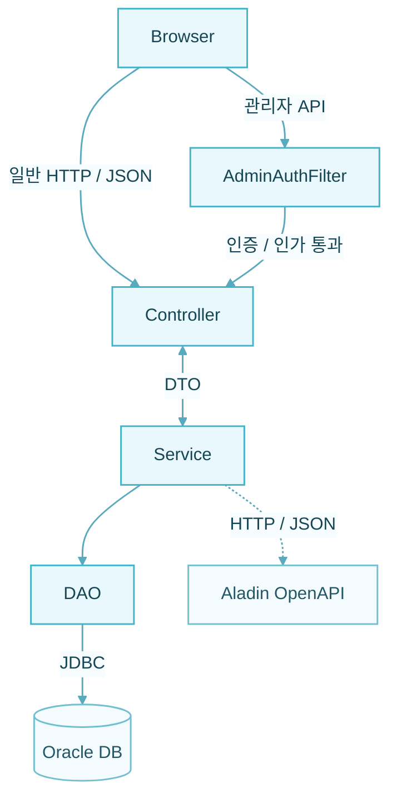

<div align="center">

# BookMate

**책을 발견하고 평가하며, 다른 독자와 취향을 공유하는 도서 커뮤니티**

[기능](#주요-기능) &nbsp;&nbsp;|&nbsp;&nbsp; [아키텍처](#아키텍처) &nbsp;&nbsp;|&nbsp;&nbsp; [실행](#로컬-실행)

</div>

<br>

## 프로젝트 소개

BookMate는 도서 검색과 평점 기록을 중심으로 개인 책장, 티어리스트, 이상형 월드컵, 커뮤니티를 하나의 독서 경험으로 연결한 웹 서비스입니다.

기본적인 CRUD에서 출발해 **세션 기반 인증과 권한 분리**, **관리자 승인 흐름**, **외부 도서 API 연동**, **사용자 활동 데이터를 활용한 취향 분석**까지 구현 범위를 확장했습니다.

<!-- TODO: 실제 서비스 화면 캡처 후 아래 주석을 교체하세요.

-->

## 주요 기능

| 영역 | 구현 내용 |
| :--- | :--- |
| **도서 탐색** | 키워드·장르·정렬·페이지네이션, 검색어 자동 완성, 상세 정보와 독자 평점 조회 |
| **평점과 책장** | 평점 및 후기 등록·수정·삭제, 점수별 필터, 사용자별 독서 활동 모아보기 |
| **취향 콘텐츠** | S~D 등급 티어리스트, 8강·16강 이상형 월드컵, 결과 저장·통계·공유 |
| **커뮤니티** | 게시글·댓글 CRUD, 좋아요, 검색, 티어리스트·이상형 월드컵 결과 첨부, 신고 |
| **회원과 권한** | 회원가입, 로그인·로그아웃, 프로필·비밀번호 변경, 세션 인증, 관리자 접근 제어 |
| **운영 관리** | 회원 이용 제한, 게시글 상단 고정·삭제, 댓글 관리, 도서·콘텐츠 템플릿 승인 및 반려 |

## 기술 스택

| 구분 | 기술 | 활용 |
| :--- | :--- | :--- |
| **Frontend** | `HTML5` `CSS3` `Vanilla JavaScript` | 화면 구성, 비동기 API 통신, ES Modules 기반 컴포넌트 분리 |
| **Backend** | `Java 21` `Jakarta Servlet 6` | JSON 기반 HTTP API, 세션·권한 처리 |
| **Database** | `Oracle Database` `JDBC` | 관계형 모델링, 제약조건, 인덱스, 페이지네이션 |
| **Runtime** | `Embedded Tomcat 10` | 별도 WAS 설정 없이 애플리케이션 실행 |
| **Data Access** | `HikariCP` `PreparedStatement` | 커넥션 재사용과 매개변수 바인딩 |
| **Data Format** | `Gson` | Java 객체와 JSON 요청·응답 변환 |
| **External API** | `Aladin OpenAPI` | ISBN 기반 도서 검색과 메타데이터 수집 |
| **Build** | `Maven` | 의존성 및 빌드 관리 |

## 아키텍처

요청 처리, 비즈니스 규칙, 데이터 접근을 Controller–Service–DAO 계층으로 분리했습니다.



- `Controller` — 요청 검증, 세션 확인, HTTP 응답 처리
- `Service` — 권한 검증, CRUD 규칙, 통계와 취향 계산
- `DAO` — SQL 실행과 데이터 매핑
- `DTO` — 계층 간 데이터 전달
- `Filter` — `/api/admin/*` 요청에 대한 공통 인증·인가

프론트엔드는 페이지별 모듈과 공통 API 클라이언트·UI 컴포넌트를 분리해 관리합니다.

## 구현 포인트

### 데이터 무결성

- 기본키·외래키와 `UNIQUE`, `CHECK` 제약조건으로 잘못된 상태를 DB 단계에서도 차단
- 도서 상태, 게시글 상태, 회원 역할 등 도메인 값을 제한
- 조회 조건에 맞춘 복합 인덱스와 Oracle `OFFSET ... FETCH NEXT` 페이지네이션 적용
- `PreparedStatement`로 사용자 입력값을 SQL과 분리

### 인증과 운영

- `HttpSession` 기반 로그인 상태 유지 및 관리자 API 필터링
- 비밀번호를 `PBKDF2WithHmacSHA256`과 개별 Salt, 120,000회 반복으로 해시
- 회원 잠금과 콘텐츠 승인·반려 등 운영자 워크플로 구현
- 입력값과 도메인 규칙을 검증하고 상황에 맞는 HTTP 상태 코드 반환

### 개발 환경

- 내장 Tomcat으로 Java 애플리케이션에서 서버를 직접 구동
- 로컬 프록시가 정적 프론트엔드와 `/api` 요청을 하나의 주소로 연결
- CSV 시드와 초기화 도구로 개발 데이터를 재현 가능하게 구성

## 데이터 모델

21개 테이블을 회원, 도서, 취향 활동, 커뮤니티, 운영 영역으로 나누어 설계했습니다.

| 영역 | 테이블 |
| :--- | :--- |
| **회원** | <code>MEMBER</code><br><code>AUTHOR</code><br><code>AUTHOR_ACCOUNT</code> |
| **도서** | <code>BOOK</code><br><code>BOOK_REQUEST</code><br><code>RATING</code> |
| **티어리스트** | <code>TIER_TEMPLATE</code><br><code>TIER_TEMPLATE_ITEM</code><br><code>TIER_LIST</code><br><code>TIER_ITEM</code> |
| **이상형 월드컵** | <code>IDEAL_TEMPLATE</code><br><code>IDEAL_TEMPLATE_ITEM</code><br><code>IDEAL_RUN</code><br><code>IDEAL_MATCH</code> |
| **커뮤니티** | <code>POST</code><br><code>POST_COMMENT</code><br><code>POST_LIKE</code><br><code>AUTHOR_REVIEW</code><br><code>REPORT</code> |
| **운영** | <code>ADMIN_LOG</code><br><code>AUTHOR_ACCOUNT_REQUEST</code> |

각 템플릿과 결과 항목은 별도 테이블로 분리하고, 회원이나 상위 콘텐츠 삭제 시 연관 데이터가 함께 정리되도록 참조 규칙을 설정했습니다.

## 프로젝트 구조

```text
book-inven/
├─ backend/
│  ├─ src/main/java/
│  │  ├─ controller/   # HTTP 엔드포인트
│  │  ├─ service/      # 비즈니스 로직
│  │  ├─ dao/          # JDBC 데이터 접근
│  │  ├─ dto/          # 요청·응답 데이터
│  │  ├─ filter/       # 관리자 권한 필터
│  │  └─ util/         # DB, 세션, 암호화, 응답 유틸리티
│  └─ pom.xml
├─ frontend/
│  ├─ pages/           # 기능별 HTML 화면
│  ├─ js/              # 페이지·API·공통 컴포넌트 모듈
│  └─ assets/          # 스타일과 아이콘
├─ db/                 # Oracle 스키마와 CSV 시드
└─ scripts/            # 실행·초기화 자동화
```

## 로컬 실행

### 준비 사항

- JDK 21
- Oracle Database
- Aladin TTB API Key

### 1. 환경 변수 설정

프로젝트 루트의 `.env.example`을 `.env`로 복사한 뒤 값을 입력합니다.

```env
DB_URL=jdbc:oracle:thin:@localhost:1521:xe
DB_USER=bookmate
DB_PASSWORD=your_password
ALADIN_TTB_KEY=your_api_key
```

### 2. 데이터베이스 초기화

프로젝트 루트에서 초기화 스크립트를 실행하고, 안내에 따라 `I`를 입력합니다.

```powershell
scripts\db-init.bat
```

이 스크립트는 Maven Wrapper로 `DBInit.java`를 실행합니다. 기존 BookMate 테이블과 데이터가 삭제된 뒤 다시 생성되므로 필요한 데이터는 먼저 백업해야 합니다.

> 기존 BookMate 테이블과 데이터가 삭제된 뒤 스키마와 개발용 데이터가 다시 생성됩니다.

### 3. 서버 실행

프로젝트 루트에서 서버 실행 스크립트를 실행합니다.

```powershell
scripts\start.bat
```

내장 Tomcat이 시작되면 `http://localhost:8080`으로 접속합니다. 서버를 종료하려면 실행 중인 창에서 `Ctrl+C`를 누릅니다.

## 프록시 구현

서비스 실행에 필수적인 구성은 아니지만, 프론트엔드와 백엔드를 서로 다른 포트로 분리했을 때의 요청 흐름을 이해하기 위해 프록시 서버를 직접 구현했습니다. `5501` 포트로 들어온 `/api/*` 요청을 `8080`의 백엔드로 전달해 별도 CORS 설정 없이 같은 출처처럼 통신합니다.

```powershell
scripts\proxy.bat
```

프록시를 실행한 경우 `http://localhost:5501`로 접속합니다.

## 취향 일치율

두 사용자의 공통 활동을 세 가지 축으로 비교합니다.

| 비교 기준 | 가중치 | 계산 대상 |
| :--- | ---: | :--- |
| **도서 평점** | **50%** | 두 사용자가 공통으로 평가한 도서의 점수 |
| **티어리스트** | **25%** | 같은 템플릿에서 배치한 도서의 S~D 등급 |
| **이상형 월드컵** | **25%** | 같은 템플릿에서 선택한 도서의 승패 기록 |

참여 기록이 없는 영역은 계산에서 제외하고 남은 가중치를 다시 배분합니다. 데이터가 일부만 있어도 비교할 수 있으며, 공통 활동 수에 따라 신뢰도를 `LOW`, `MEDIUM`, `HIGH`로 함께 제공합니다.

## 팀

3명이 함께 개발한 팀 프로젝트입니다.

- [ahnjh97](https://github.com/ahnjh97)
- [jungryulip](https://github.com/jungryulip)
- [mean71](https://github.com/mean71)

<br>

<div align="center">
도서 CRUD를 중심으로 인증, 권한, 외부 API, 통계와 사용자 간 상호작용까지 확장한 프로젝트입니다.
</div>
