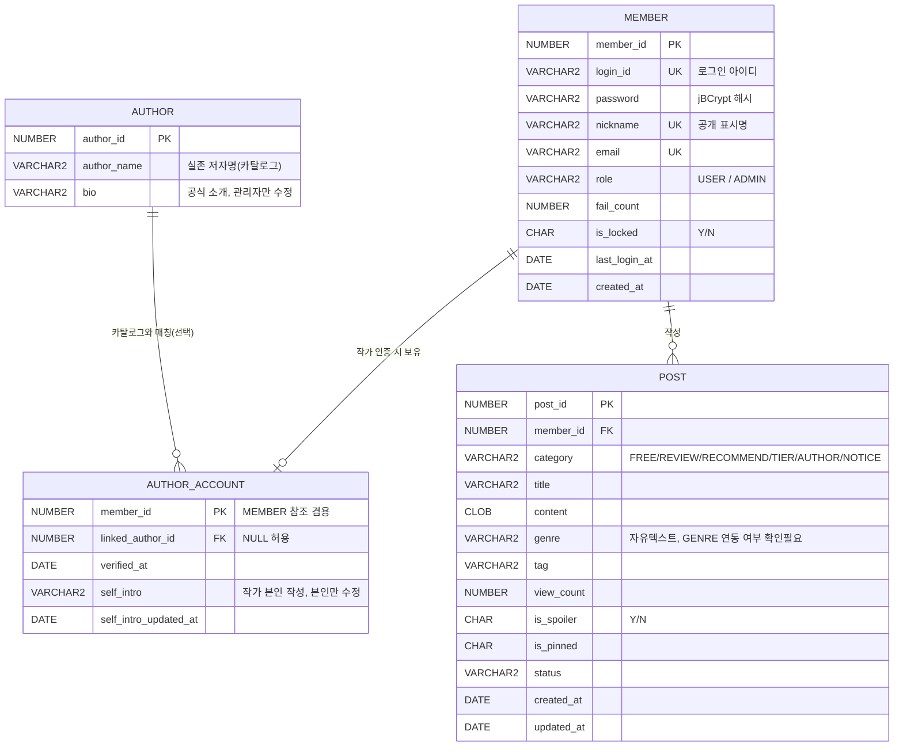

**관계 표기**

| 관계   | 의미 |
| ------ | ---- |
| MEMBER |      |
| AUTHOR |      |
| MEMBER |      |

J/L 파트 테이블(BOOK, GENRE, RATING, TIER_LIST/ITEM, REPORT, COMMENT) 확정시 이어서 관계 추가필요
POST.book_id같은  FK 등
